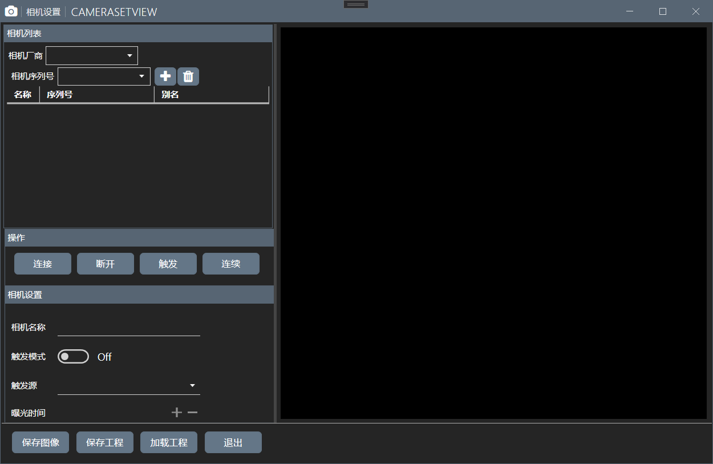

** CatVision 通用工控视觉程序

> 主要设计：使用Roslyn编译算法脚本

*** 讨论和TODO

1. 主要包含：算法脚本编译，工控领域通信，工业相机适配，基本完成设计
2. 也设计了多语言、多主题支持
3. 主进程还没写，日志和全局消息部分还没用，软件参数设置界面等还没设计，登录和授权部分还没写，还有一堆Bug没修
4. 未在其他及其上测试过Release包的兼容性

下面是一些图片

